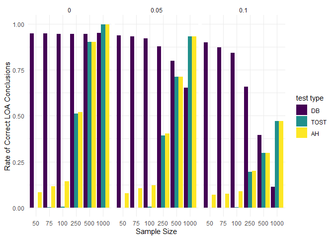

New sim with visualizations
================
Udi Alter
20/06/2020

``` r
# Uploading raw data
simresults <- readxl::read_xlsx("simulation results.xlsx", col_names = TRUE)
View(simresults)


simresults$approach <- factor(simresults$approach, levels = c("difference based", "equivalence based"), ordered = FALSE)
simresults$`test type` <- factor(simresults$`test type`, levels = c("DB", "TOST", "AH"), ordered = TRUE)
simresults$predictor <- factor(simresults$predictor, levels = c(1, 2, 3, 4, 5), ordered = TRUE)
simresults$`effect size` <- factor(simresults$`effect size`, levels = c(0, 0.05, 0.1, 0.15, 0.2), ordered = TRUE)
simresults$`sample size` <- factor(simresults$`sample size`, levels = c(50, 75, 100, 250, 500, 1000), ordered = TRUE)


str(simresults)
```

    ## tibble [90 x 6] (S3: tbl_df/tbl/data.frame)
    ##  $ approach           : Factor w/ 2 levels "difference based",..: 1 1 1 1 1 1 1 1 1 1 ...
    ##  $ test type          : Ord.factor w/ 3 levels "DB"<"TOST"<"AH": 1 1 1 1 1 1 1 1 1 1 ...
    ##  $ predictor          : Ord.factor w/ 5 levels "1"<"2"<"3"<"4"<..: 1 1 1 1 1 1 2 2 2 2 ...
    ##  $ effect size        : Ord.factor w/ 5 levels "0"<"0.05"<"0.1"<..: 1 1 1 1 1 1 2 2 2 2 ...
    ##  $ sample size        : Ord.factor w/ 6 levels "50"<"75"<"100"<..: 1 2 3 4 5 6 1 2 3 4 ...
    ##  $ LOA conclusion rate: num [1:90] 0.95 0.95 0.948 0.947 0.946 ...

``` r
ggplot(data = simresults) + 
  geom_bar(mapping = aes(x = `sample size`, y= `LOA conclusion rate`, fill = `effect size`),stat = "identity", position = "dodge")+ 
  facet_wrap(~`test type`, nrow = 3)+theme_minimal()
```

<!-- -->

``` r
ggplot(data = simresults) + 
  geom_bar(mapping = aes(x = `sample size`, y= `LOA conclusion rate`, fill = `test type`),stat = "identity", position = "dodge")+ 
  facet_grid(~`effect size`)+theme_minimal()
```

<!-- -->

``` r
# using subset correct vs. incorrect LOA conclusions
correctLOA <- subset(simresults, simresults$`effect size` != "0.15" & simresults$`effect size` != "0.2") 

View(correctLOA)

incorrectLOA <- subset(simresults, simresults$`effect size` == 0.15 | simresults$`effect size` == 0.2) 

View(incorrectLOA)
```

``` r
ggplot(data = correctLOA) + 
  geom_bar(mapping = aes(x = `sample size`, y= `LOA conclusion rate`, fill = `effect size`),stat = "identity", position = "dodge")+ 
  facet_wrap(~`test type`, nrow = 3)+theme_minimal()+labs(y="Rate of Correct LOA Conclusions", x = "Sample Size")
```

<!-- -->

``` r
ggplot(data = incorrectLOA) + 
  geom_bar(mapping = aes(x = `sample size`, y= `LOA conclusion rate`, fill = `effect size`),stat = "identity", position = "dodge")+ 
  facet_wrap(~`test type`, nrow = 3)+theme_minimal()+labs(y="Rate of Incorrect LOA Conclusions", x = "Sample Size")
```

<!-- -->
